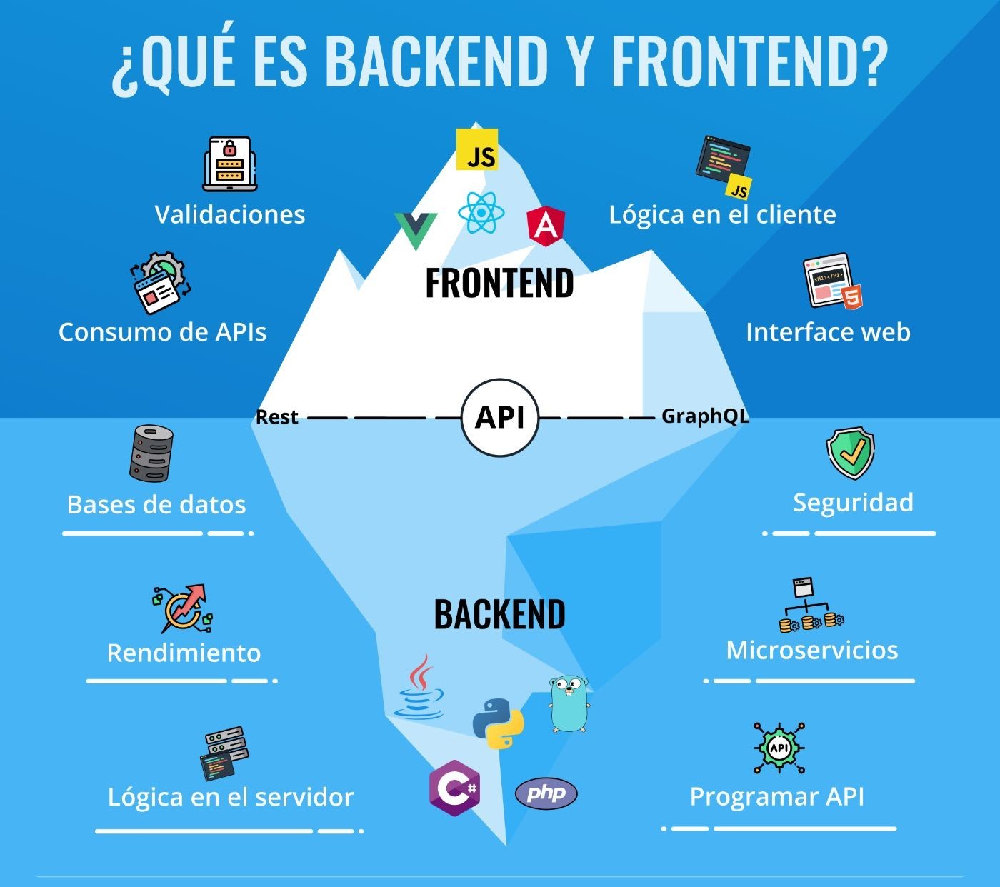
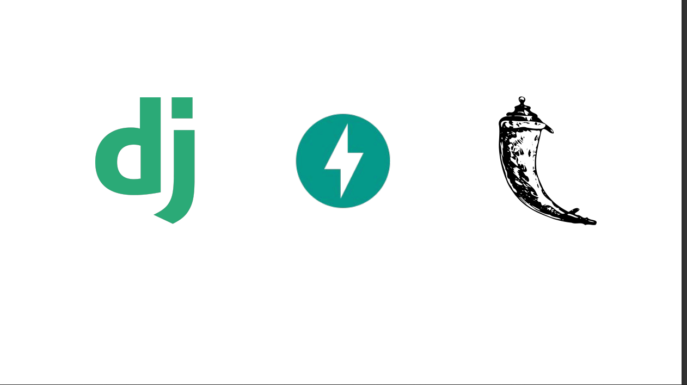
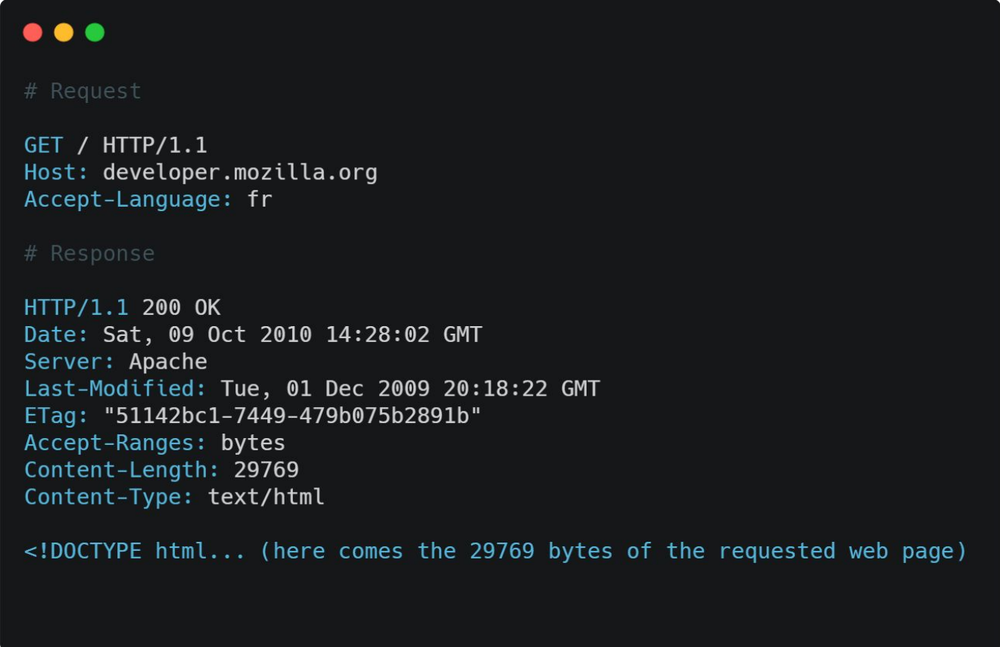
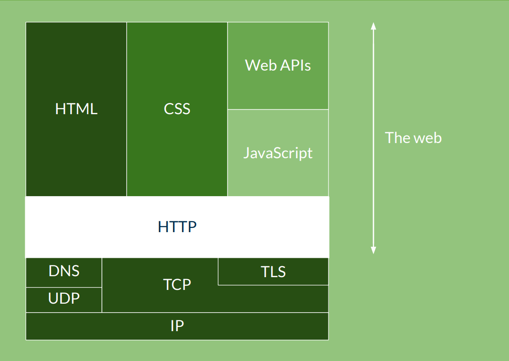

# Introduccion al desarrollo Backend

---

---

# El motor y la carroceria de un producto digital

---

---

---

# Framework vs. libreria

---

---

# Como se conecta el frontend con el backend? 
## Api y json

---

# SOAP
## Simple Object Access Protocol

--- 

# REST

### Representational State Transfer

---

# XML
## Extensible Markup Languaje

---

---

# JSON

## Javascript Object Notation

---

---

# El lenguaje que habla internet:
# HTTP
## Hypertext Transfer Protocol

---

---

---

---
# Flujo de desarrollo de una aplicacion web

## Localhost, Produccion, despliegue

---

# El Hogar de tu codigo:
# El servidor o la nube ?

---

---
# Diseño y bosquejo de una Api-Rest.

---
# Que lenguaje escoger para backend

